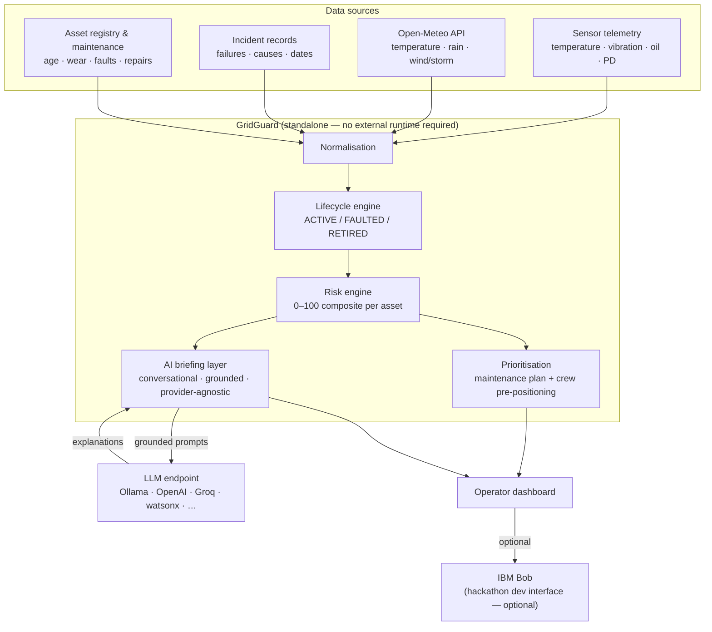

# ⚡ GridGuard

> **Grid asset intelligence and maintenance prioritization.**  
> Fuse sensor telemetry, weather forecasts, failure history, and lifecycle state into one explainable risk score per asset — then act on it before the failure happens.

[](#-running-tests)
[](#-prerequisites)
[](#-installation)

---

## 👥 Team

| Field | Value |
|---|---|
| **Team Name** | GG — GridGuard |
| **Track** | AI |

---

## 🎯 Problem

Power transformer and substation failures cause blackouts costing utilities **$1M+ per hour**. Most utilities still run **calendar-based maintenance** while sensors already measuring temperature, vibration, partial discharge, and oil quality show failure signatures **weeks in advance**. Weather events compound the risk — but sensor data, weather forecasts, and incident history are never combined in time to act.

---

## 💡 Solution

GridGuard is a **standalone grid asset intelligence and maintenance-prioritization system**. It fuses the four data dimensions utilities already own — sensor telemetry, Open-Meteo weather forecasts, historical incident records, and asset degradation/lifecycle state — into a per-asset **0–100 risk score**. Assets are ranked by risk **and** grid impact (customers served, critical facilities, downstream cascade, redundancy) to produce a prioritized maintenance plan, crew pre-positioning recommendations, and conversational AI explanations — all grounded in the deterministic engine's output.

---

## ✨ What's Built

| Layer | What it does | Status |
|---|---|---|
| **Risk engine** | Composite 0–100 score per asset: sensor health (30%), weather (20%), historical failure (15%), degradation (15%), grid impact (20%). Normal / Watch / High / Critical bands. | ✅ Implemented — 69 tests |
| **Normalisation** | Converts physical-unit sensor readings (°C, pC, kV, mm/s, km/h) to 0–100 scores using IEC-standard alarm thresholds. | ✅ Implemented — 117 tests |
| **Lifecycle engine** | Pure-function state machine: ACTIVE → FAULTED → RETIRED. Replacement retires the old unit with its full history intact and creates a clean-state successor with a lineage link. | ✅ Implemented — 94 tests |
| **Storage** | SQLite asset registry, lifecycle records, risk snapshots, retired-asset lineage. Seeded with 8 synthetic demo assets. | ✅ Implemented — 67 tests |
| **Weather integration** | Staged static storm scenario per asset location by default (deterministic demo); opt-in live Open-Meteo forecasts via `GRIDGUARD_LIVE_WEATHER=1`. No API key required. | ✅ Implemented — 61 tests |
| **AI briefing layer** | Conversational operator assistant grounded in engine outputs. Supports follow-up questions, casual reactions, and tone-adaptive responses. Provider-agnostic: OpenAI-compatible endpoint, watsonx.ai (optional), or offline mock. | ✅ Implemented — 145 tests |
| **Dashboard API** | Stdlib-only HTTP server. `/api/summary`, `/api/assets`, `/api/priorities`, `POST /api/briefing` with conversation history. | ✅ Implemented — 13 tests |
| **Operator dashboard** | Browser control-room view: fleet summary, per-asset risk cards, ranked maintenance plan, crew pre-positioning, AI assistant chat. | ✅ Implemented |

**566 tests passing. Zero network calls in the test suite.**

---

## 🏗️ Architecture



Full component table, data flow, grounding approach, and security notes: **[docs/architecture.md](docs/architecture.md)**

---

## 🔢 Risk Score

```
overall = sensor_health × 0.30
        + weather_risk  × 0.20
        + historical_failure × 0.15
        + asset_degradation  × 0.15
        + grid_impact        × 0.20

Normal 0–39   Watch 40–69   High 70–84   Critical 85–100
```

Every component score is independently auditable. The dominant factor (highest weighted contribution) is surfaced alongside the overall score and used to anchor AI briefings.

---

## 🤖 AI Briefing Layer

The LLM **never calculates risk** — the deterministic engine runs first. The AI briefing layer:

1. Assembles a `BriefingContext` from `RiskResult` + `RiskInputs` — every field traces directly to the engine, nothing invented
2. Injects it as a JSON block with an explicit **GROUNDING RULE** that forbids the model from referencing values outside that block
3. Includes full conversation history so follow-up questions are answered in context, not as fresh reports
4. Adapts tone and length: short question → concise answer; casual reaction → natural reply; "1 liner" → one line

```
User: What's wrong with TX-007?
AI:   TX-007 is Critical at 95.4. The main driver is sensor health (95.6/100)
       — top-oil at 94 °C, PD at 2200 pC, oil dielectric failed at 18 kV —
       on a 43-year-old unit past its rated life with 4 failures in 5 years.
       Inspect today.

User: Why is the weather such a big deal?
AI:   Weather risk is 96.8 — wind/storm scores 100 with an 82 mm, 115 km/h
       front inbound, and 3 of TX-007's 4 failures in the last 5 years were
       weather-triggered. The storm compounds an already-degraded asset.

User: oh shit
AI:   Yeah — that combination is exactly the scenario you pre-position for.
       Get a crew staged before the front arrives.
```

---

## 🔌 LLM Configuration

GridGuard works with any OpenAI-compatible endpoint — self-hosted or hosted:

```bash
# Ollama (local, no key needed)
LLM_BASE_URL=http://localhost:11434/v1
LLM_MODEL=llama3

# OpenAI
LLM_BASE_URL=https://api.openai.com/v1
LLM_API_KEY=sk-...
LLM_MODEL=gpt-4o-mini

# Groq
LLM_BASE_URL=https://api.groq.com/openai/v1
LLM_API_KEY=gsk_...
LLM_MODEL=llama-3.1-8b-instant
```

Auto-detection: `"openai"` when `LLM_BASE_URL` or `LLM_API_KEY` is set · `"watsonx"` when `WATSONX_API_KEY` is set · `"mock"` (offline-safe) when nothing is configured.

IBM watsonx.ai is supported as an optional provider (`GRIDGUARD_LLM_PROVIDER=watsonx`).

---

## 🚀 Quick Start

**Prerequisites:** Python 3.10+ · no pip install required (stdlib only)

```bash
# 1. Clone
git clone https://github.com/Dummy-pixel-hash/GG-GridGuard.git
cd GG-GridGuard

# 2. (Optional) configure a live LLM — works offline without this
cp src/.env.example src/.env
# edit src/.env: set LLM_BASE_URL, LLM_API_KEY, LLM_MODEL

# 3. Run the dashboard
python3 run_ui.py
# → http://localhost:8000
```

Startup seeds the 8-asset demo dataset, scores every asset with the live risk engine, and serves the dashboard. AI briefings work offline via the built-in mock provider; the server prints which LLM provider and model it is using.

---

## 🧪 Running Tests

```bash
python3 -m pytest -q
```

566 tests · 0 network calls · no credentials required.

| Module | Tests | Covers |
|---|---|---|
| `test_risk_engine.py` | 69 | All five scoring functions, band boundaries, dominant factor, determinism |
| `test_normalisation.py` | 117 | Physical-unit → 0–100 conversion, IEC thresholds, missing sensors, validation |
| `test_lifecycle.py` | 94 | State machine transitions, fault stress, repair, replacement lineage |
| `test_storage.py` | 67 | SQLite round-trips, lifecycle serialisation, risk result history, seeder idempotency |
| `test_weather.py` | 61 | Open-Meteo parsing, storm classification, fallback handling |
| `test_ai_briefing.py` | 145 | Context grounding, all prompt templates, conversation history, OpenAI provider (mocked HTTP), config auto-detection |
| `test_api_service.py` | 13 | Full pipeline from demo asset to scored API response |

---

## 📁 Repository Structure

```
GG-GridGuard/
├── run_ui.py                    ← Start the operator dashboard
├── pyproject.toml               ← Python project / pytest config
│
├── src/
│   ├── .env.example             ← Environment variable template
│   ├── risk_engine/             ← Composite 0–100 risk scorer
│   │   ├── calculator.py        ← score_asset() entry point
│   │   ├── models.py            ← RiskInputs, RiskResult, ComponentScores
│   │   └── scoring/             ← Five independent component functions
│   ├── normalisation/           ← Raw sensor/weather → 0–100 normaliser
│   ├── lifecycle/               ← Asset state machine + replacement lineage
│   ├── data/                    ← Raw type definitions + 8 synthetic demo assets
│   ├── weather/                 ← Open-Meteo client + storm classifier
│   ├── storage/                 ← SQLite schema, repositories, seeder
│   ├── ai_briefing/             ← Conversational AI layer (provider-agnostic)
│   │   ├── service.py           ← BriefingService.chat() + structured methods
│   │   ├── prompts.py           ← Grounded + conversational prompt templates
│   │   ├── context_builder.py   ← RiskResult → BriefingContext (grounding)
│   │   ├── provider.py          ← OpenAIProvider, WatsonxProvider, MockProvider
│   │   └── config.py            ← BriefingConfig.from_env()
│   ├── api/
│   │   ├── grid_service.py      ← GridState: scores all assets, routes questions
│   │   └── server.py            ← Stdlib HTTP server + static file serving
│   ├── frontend/
│   │   ├── index.html           ← Operator dashboard
│   │   ├── app.js               ← Dashboard logic + AI chat panel
│   │   └── styles.css           ← Dashboard styles
│   └── tests/                   ← 546 tests across all modules
│
├── docs/
│   ├── problem-statement.md
│   ├── solution-overview.md
│   ├── architecture.md
│   ├── setup-guide.md
│   └── template-guide.md
│
├── demo/                        ← Video link, live demo URL, screenshots
├── presentation/                ← Slide deck
└── submission.yaml              ← Hackathon submission metadata
```

---

## 🔍 Key Design Decisions

| Decision | Why |
|---|---|
| **Deterministic, interpretable 0–100 score** | Operators must trust and audit the score. No labeled failure corpus exists at hackathon scale for a black-box model. Weights are locked and documented; each component is independently auditable. |
| **Risk and grid impact kept separate** | "Likely to fail" and "failure is catastrophic" are different questions — a lower-probability failure on a hospital feeder can outrank a likely failure on a redundant branch. |
| **Lifecycle lineage preserved on replacement** | A replacement transformer must not inherit its predecessor's wear — but the history must survive for incident learning. Replacement retires the old unit with full history intact and spawns a clean-state successor with a `predecessor_asset_id` link. |
| **LLM for explanation only, not scoring** | Deterministic scoring stays auditable. The LLM gets pre-computed scores as grounded context and is instructed not to invent values. |
| **Provider-agnostic LLM layer** | GridGuard should run on any infrastructure — local Ollama, hosted OpenAI, Groq, watsonx, whatever the operator has. Three env vars configure it. Offline mock is the default. |
| **Stdlib-only runtime** | Zero pip install friction for judges and operators. The risk engine, lifecycle engine, normalisation, storage, HTTP server, and conversation history all use the Python standard library. |
| **Conversational history over per-call dispatch** | The old approach keyword-matched each question and produced a fresh full report every time. Passing conversation history to a single adaptive prompt lets the model answer follow-ups correctly and react naturally to casual messages. |

---

## ⚠️ Known Limitations

- Risk weights are tunable design parameters, not validated against real utility failure data (none available)
- Demo runs on 8 synthetic assets — no real utility asset data or PII in the repository
- Prioritization ranking combines risk + grid impact by sort order; a more sophisticated joint-scoring formula is a natural next step
- IBM Bob MCP tool surface is not yet implemented (planned; GridGuard runs without it)
- Dashboard UI is functional but not production-polished

---

## 📚 Documentation

| Doc | Contents |
|---|---|
| [`docs/problem-statement.md`](docs/problem-statement.md) | Problem depth: who is affected, why now, why existing tools fall short |
| [`docs/solution-overview.md`](docs/solution-overview.md) | How GridGuard works, key design decisions, configuration |
| [`docs/architecture.md`](docs/architecture.md) | System architecture, component table, data flow, grounding approach, IBM Bob's role |
| [`docs/setup-guide.md`](docs/setup-guide.md) | Prerequisites, env vars, install, run, test, troubleshoot |

---

## 💬 IBM Bob

IBM Bob is used during the hackathon as a development and demonstration interface. GridGuard is a standalone application — it runs without Bob installed or active:

- The risk engine, lifecycle engine, normalisation, storage, and weather integration have no dependency on Bob
- The AI briefing layer calls an LLM directly over HTTP — it does not require Bob
- Bob can optionally surface GridGuard's capabilities via MCP tool integration for natural-language operator queries; this is a planned hackathon integration, not a runtime dependency

---

*GridGuard — predict which failure hurts the grid most, why, and what to do about it this week.*
