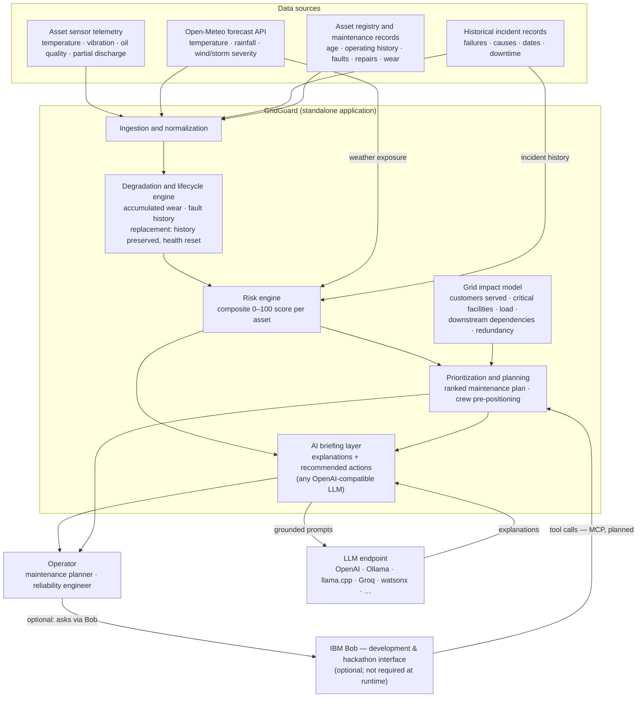

# Architecture

## System Architecture



## Components

| Component | Technology | Responsibility |
|---|---|---|
| Ingestion & normalization | **Python — `src/normalisation/`** | Converts raw physical-unit measurements (°C, pC, kV, mm/h, km/h) into 0–100 normalised scores using IEC-standard alarm thresholds. `normalise(RawAssetRecord) → RiskInputs`. Includes `load_score` from current load factor. Cold-stress neutral corrected to 0 °C. Input validation via `NormalisationError`. Thresholds in `src/normalisation/thresholds.py`. Demo data in `src/data/`. |
| Degradation & lifecycle engine | **Python — `src/lifecycle/`** | Pure-function state machine: `apply_fault`, `apply_maintenance`, `apply_repair`, `apply_replacement`, `advance_age`. Three states: ACTIVE / FAULTED / RETIRED. Fault stress degrades `insulation_health_pct`; repair improves it. `apply_replacement` retires the physical unit (full history preserved in `RetiredAssetRecord`) and creates a clean-state successor with `predecessor_asset_id` lineage link. `advance_age` only increments age — `maintenance_overdue_days` is managed by maintenance/repair events, not age ticks. |
| Risk engine | **Python — `src/risk_engine/`** | Composite 0–100 score per asset from five factor groups: sensor health (30%), weather (20%), historical failure (15%), asset degradation (15%), grid impact (20%). Bands: Normal/Watch/High/Critical. Sensor health includes current load (5%) and a 40-pt missing-sensor floor. Historical failure includes MTBF sub-signal (0–10 pts). |
| Grid impact model | **Python — `src/risk_engine/scoring/grid_impact.py`** | Consequence-of-failure score from customers served, critical facilities, peak load, downstream cascade, and N-1 redundancy. Non-critical sub-scores discounted 40% when N-1 path exists; critical-facility points are never discounted. |
| Prioritization & planning | **Python — `src/api/grid_service.py`** | Assets ranked by overall risk then grid impact into a prioritized day's work order list. Crew pre-positioning identifies weather-exposed (weather risk ≥60 or storm level ≥2) high-consequence (risk ≥70 or critical facilities > 0) assets and groups them by region for pre-storm staging. |
| AI briefing layer | **Python — `src/ai_briefing/`** | LLM-generated explanations of risk factors and recommended actions, grounded in engine-computed scores. Provider-agnostic: any OpenAI-compatible endpoint works. Configurable via `LLM_BASE_URL`, `LLM_API_KEY`, `LLM_MODEL`. Falls back to deterministic `MockProvider` when no credentials are set (safe for CI/offline). IBM watsonx.ai is supported as an optional provider. |
| Operator interface | IBM Bob (MCP tool integration — planned) | Natural-language queries over risk, rankings, plans, and briefings. Bob is part of the hackathon development workflow; GridGuard runs independently without it. |
| Weather source | Open-Meteo API — `src/weather/` | 72-hour forecast per asset location: temperature, rainfall, wind gust speed, storm severity (no API key required). Refreshed live at `GridState` startup via `fetch_weather_with_fallback`; static demo data kept on network failure. |
| Storage | SQLite — `src/storage/` | Asset registry, lifecycle records, risk results. Schema in `src/storage/schema.py`. |

## Data Flow

1. Asset registry, sensor telemetry, and incident records are loaded for a
   representative distribution network (8-asset synthetic demo dataset in
   `src/data/`).
2. Open-Meteo 72-hour forecasts are fetched per asset location at startup
   (temperature, rainfall, wind gust speed, storm severity). This is
   best-effort: if the fetch fails for an individual asset its static demo
   weather is kept. `storm_warning_level` is derived from actual forecast
   values via `classify_storm_level`.
3. The degradation & lifecycle engine maintains per-asset degradation state;
   a replacement spawns a clean-state successor while the predecessor's
   history is preserved.
4. The risk engine computes a 0–100 composite score per asset from the five
   factor groups; scores aggregate by substation/area into outage-prone-area
   views.
5. The grid impact model computes a consequence-of-failure score per asset.
6. Prioritization ranks assets by risk + grid impact into the maintenance
   plan; the storm window filters weather-exposed, high-impact assets into
   crew pre-positioning recommendations.
7. The AI briefing layer assembles a grounded `BriefingContext` (all values
   from the risk engine, none invented) and sends it with a structured prompt
   to the configured LLM endpoint.  The LLM explains and reasons over the
   provided scores; it does not recalculate them.
8. Operators receive risk scores, ranked plans, and plain-language briefings.
   IBM Bob can optionally surface these via MCP tool calls during the
   hackathon; at runtime GridGuard has no dependency on Bob.

## AI Briefing Layer — Configuration

GridGuard's LLM layer is provider-agnostic.  Configure it with three
environment variables and point it at any OpenAI-compatible endpoint:

```
LLM_BASE_URL=http://localhost:11434/v1   # Ollama local model
LLM_API_KEY=                             # empty for local servers
LLM_MODEL=llama3
```

Other examples:

| Provider | `LLM_BASE_URL` | Notes |
|---|---|---|
| OpenAI | `https://api.openai.com/v1` | Set `LLM_API_KEY=sk-…` |
| Ollama (local) | `http://localhost:11434/v1` | No key needed |
| llama.cpp server | `http://localhost:8080/v1` | No key needed |
| Groq | `https://api.groq.com/openai/v1` | Set `LLM_API_KEY=gsk_…` |
| Together AI | `https://api.together.xyz/v1` | Set `LLM_API_KEY` |
| IBM watsonx.ai | Set `GRIDGUARD_LLM_PROVIDER=watsonx` | Uses `ibm_watsonx_ai` SDK |

`GRIDGUARD_LLM_PROVIDER` is auto-detected:
- `"openai"` when `LLM_BASE_URL` or `LLM_API_KEY` is set
- `"watsonx"` when `WATSONX_API_KEY` is set (and no `LLM_*` vars)
- `"mock"` when nothing is configured — safe default for CI and offline use

## Grounding Approach

The LLM never calculates risk.  The deterministic engine runs first; its
output (`RiskResult` + `RiskInputs`) is assembled into a structured
`BriefingContext` dataclass (every field traces directly to the engine).
That context is serialised as JSON and injected into the prompt, alongside
an explicit **GROUNDING RULE** that forbids the model from referencing values
outside the provided block.  The LLM's job is to translate the numbers into
operator-readable reasoning, not to produce or estimate them.

## IBM Bob — Development Role

IBM Bob is used during the hackathon as a development and demonstration
interface.  GridGuard is a standalone Python application that runs without
Bob installed or active:

- The risk engine, lifecycle engine, normalisation, and weather integration
  have no dependency on Bob.
- The AI briefing layer calls an LLM directly over HTTP; it does not require
  Bob to be running.
- Bob can optionally call GridGuard via MCP tool integration for natural-
  language operator queries, but this is a demo/hackathon convenience, not a
  runtime dependency.

## Security Considerations

- All credentials via environment variables (`src/.env.example` pattern);
  `.env` is gitignored and never committed.
- Open-Meteo requires no API key for non-commercial use.
- LLM credentials (`LLM_API_KEY`, `WATSONX_API_KEY`) held in environment
  variables only; never hardcoded.
- Demo/sample data is synthetic — no real utility data or customer PII in
  the repository.
- AI briefings are generated from engine-computed factors only; the
  grounding rule in every prompt prevents the LLM from inventing or
  estimating values not provided.

## Scalability Notes

- Risk scoring is per-asset and stateless given its inputs — horizontally
  scalable; weather calls batch naturally per region.
- Hackathon scope: a single representative distribution network with
  in-process computation.
- Beyond the hackathon: streaming sensor ingestion, per-region weather jobs,
  and model retraining on lifecycle-preserved incident history — which is
  exactly why lineage preservation is a core design element rather than an
  afterthought.
